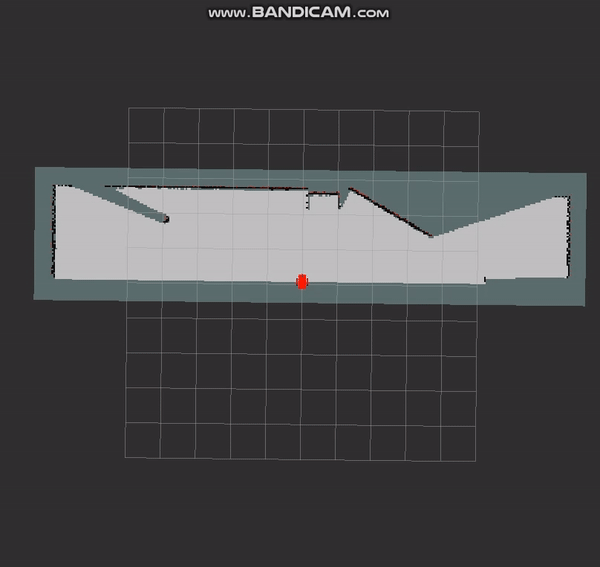
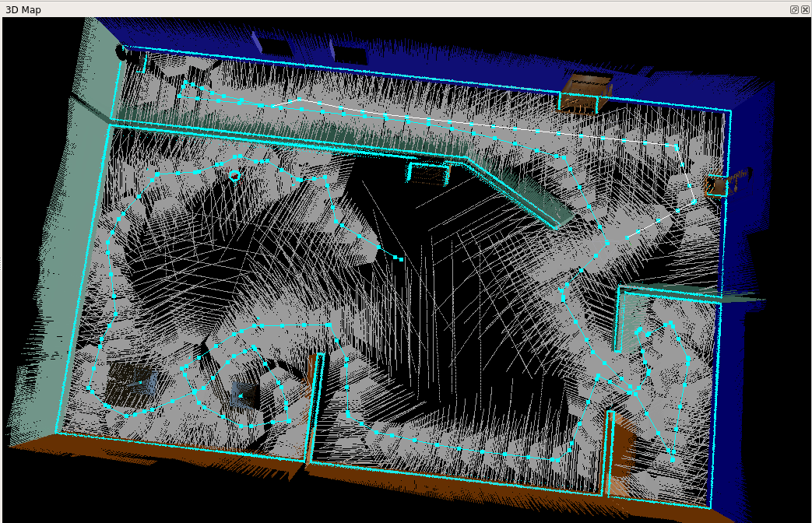
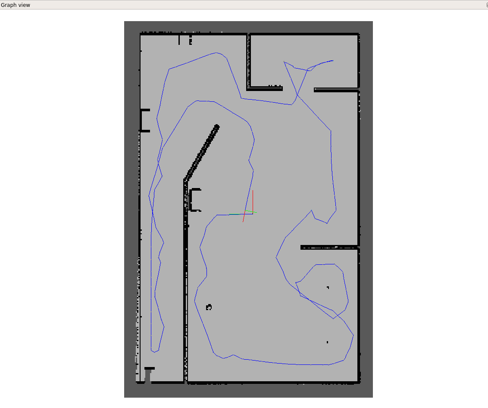

# Map My World
In this project, you are executing simultaneous localization & mapping(SLAM) which means the robot is able to localize itself and map the world whilst moving around.
## Before getting started
* Ubuntu-16.04  
* ROS Kinetic  
* Gazebo-7.x.x
```console
sudo apt install ros-kinetic-rtabmap-ros  # Mapping package
```
## Build and Launch
Once you have installed all the prerequisites, you need to build the project.
```console
$ cd ~/catkin_ws
$ catkin_make
```
Then you may have build and devel directoiries. Now time to launch!
```console
$ source devel/setup.bash
$ roslaunch my_robot world.launch
```
Open a new terminal, then launch mapping.
```console
$ source devel/setup.bash
roslaunch my_robot mapping.launch
```
To control the robot with a keyboard, you may need 'Teleop Package'. Open another terminal execute the commands below.
```console
$ cd ~/catkin_ws/src
$ git clone https://github.com/ros-teleop/teleop_twist_keyboard
$ cd ..
$ catkin_make
$ source devel/setup.bash
$ rosrun teleop_twist_keyboard teleop_twist_keyboard.py
```

## Result
Now 3packages are operating, then you can move the robot with teleop package. The more you move around, the more information you get about the map. Below is the example.  
   

As a result, you can get the whole map of the world.
|3D Map|Graph View|
|:---:|:---:|
||| 
